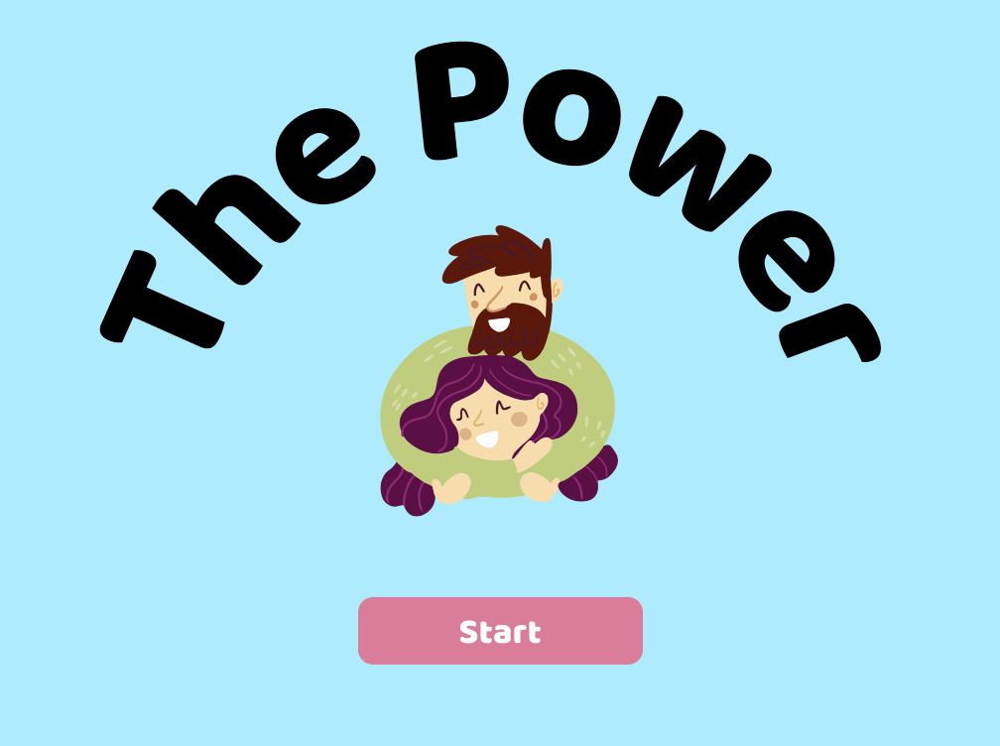

#  The Power of Hugs #

We live days where the feeling of loneliness grows scary. In contrast to the exposure of private life, which should be the connecting link between people, what we see are imprisonments in existential islands. We are affectionate beings, we need the relationship with the other to constitute ourselves, but the search exacerbated by being in evidence and by self-promotion has made these affective interactions secondary. The consequences of loneliness are high, it has already become a public health issue in several countries. So, to speak of embrace, in days where it is no longer possible to see who is around, it becomes a revolutionary act.To speak of embrace is to talk about emotional well-being, to draw attention to the need to renew the bonds that unite us to a better, more human life, far from isolation. Loneliness can be a triggering factor for psychic illnesses, including suicidal thoughts, so we need to talk about factors that reduce loneliness, reduce distancing between people, and embrace is one of the most powerful factors. A hug costs nothing to those who give but is worth so much to those who receive, its benefits echo in physical and emotional health. So I chose as the theme of the playground The Power of Embrace. To remember that there is someone on our side, closer than we realize, who may be in need of help, and this power to help can be with us, may be the distance of a hug. Who embraces, embrace yourself.